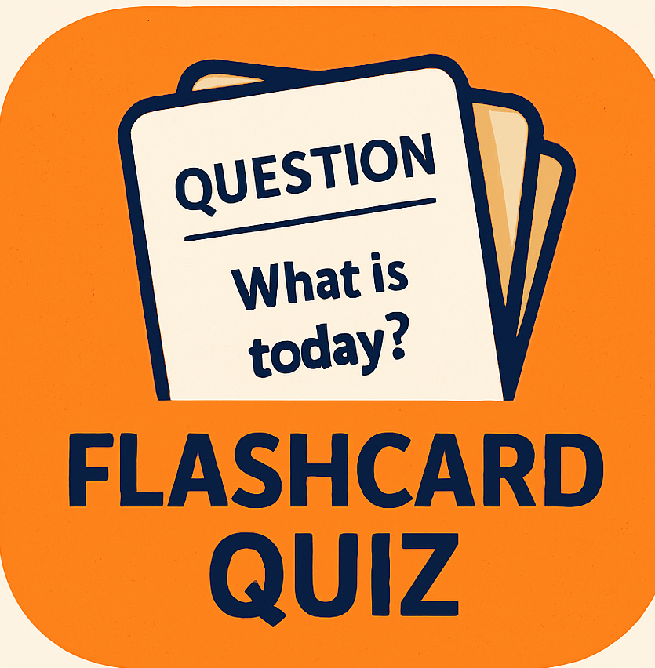

# 📚 Flashcard Quiz App

A modern flashcard quiz application built with **Expo Router**, **React Native**, and **Supabase**. Create, edit, and flip through flashcards with smooth animations and persistent cloud storage.

## 🚀 Features

- 🔄 Flip animation between questions and answers
- ➕ Add/edit flashcards with Supabase backend
- 🧠 Context API for global state management
- 🧭 Navigation powered by Expo Router
- 💾 Data synced to Supabase in real-time
- ✨ Toast notifications and loading indicators
- 📱 Fully responsive and works on Android, iOS, and Web

---

## 📦 Tech Stack

- [Expo Router](https://docs.expo.dev/router/)
- [React Native](https://reactnative.dev/)
- [Supabase](https://supabase.com/)
- [Reanimated v3](https://docs.swmansion.com/react-native-reanimated/)
- [React Native Paper](https://callstack.github.io/react-native-paper/)
- [react-native-toast-message](https://github.com/calintamas/react-native-toast-message)

---

## 🛠️ Getting Started

### 1. Clone the Repository

```bash
git clone https://github.com/your-username/flashcard-quiz.git
cd flashcard-quiz
```
### 2. Install dependencies

```bash
npm install
```
### 3. Run the app

```bash
npx expo start
```

---

### 📁 File Structure

```bash
.
├── app/
│   ├── +not-found.tsx
│   ├── _layout.tsx
│   ├── _editCard.tsx
│   └── (tabs)/
│       ├── add-card.tsx
│       ├── index.tsx
│       ├── view-cards.tsx
│       └── _layout.tsx
├── components/
│   ├── CardViewer.tsx
│   ├── CardEditor.tsx
│   └── NextButton.tsx
├── context/
│   └── FlashcardContext.tsx
├── lib/
│   └── supabase.ts
├── assets/
│   └── Quiz_icon.png
├── .env
└── README.md

 ```
---

### 📸 App Icon



---
### 💡 Planned Features
- 🔐 User authentication

- 🗂 Flashcard deck organization

- 👆 Swipe gestures for flipping and switching cards

- 📊 Card difficulty tracking

- 🧪 Quiz mode with scoring

### 🧠 License
MIT License — use it freely, and make learning fun 🎓


